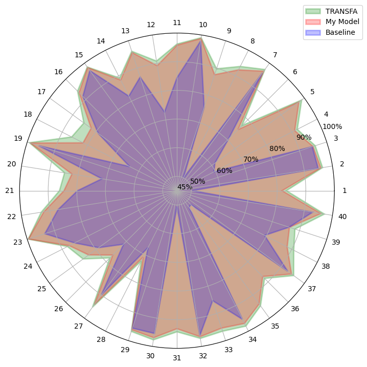
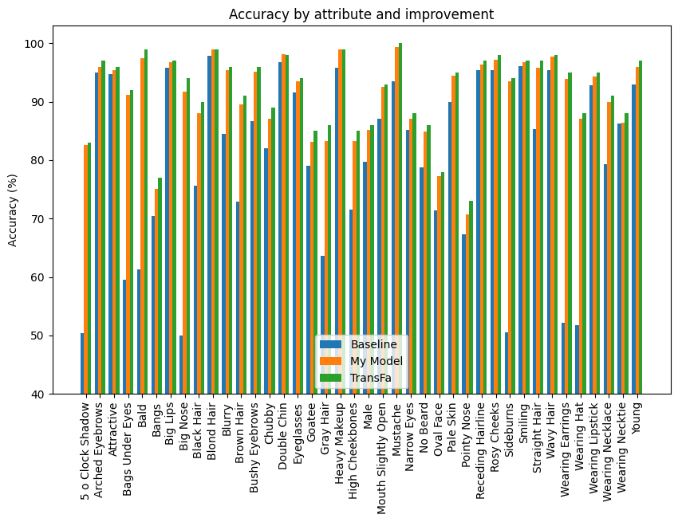

# Facial-Attribute-Recognition

[PDF](paper.pdf)

## Project Overview

This project aims to recognize various facial attributes in images. This is achieved by using the Transformer architecture, a model architecture that uses self-attention mechanisms and has been successful in various tasks in the field of natural language processing.

## Results

The current iteration of the model achieves 90.7% accuracy on the CelebA dataset.
It uses 15.6M parameters and with an inference latency of 1.18ms on an iPhone 14 Pro Max it is capable of real-time face attribute classification.

The images below show my model compared to state of the art models.
The baseline being predicting attributes on the test dataset based on attribute distribution on the training dataset, where if an attribute probability is below 0.5 then it is subtracted from 1.

## Installation and Setup

1. Clone the repository: `git clone https://github.com/Cyanosite/Intel-Image-Classification.git`
2. Navigate into the project directory: `cd Facial-Attribute-Recognition`
3. Install the required dependencies: `pip install -r requirements.txt`

## Contact

Zsombor Szenyán - zsomborszenyan@edu.bme.hu
